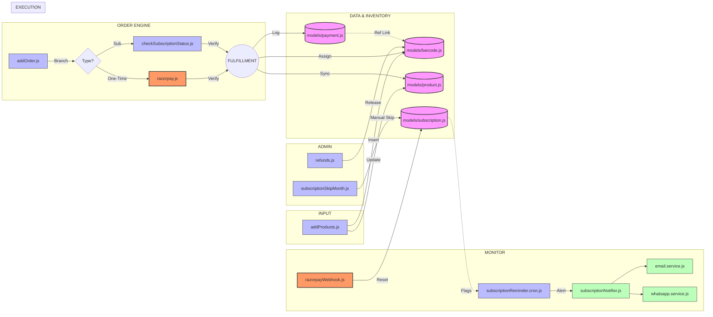
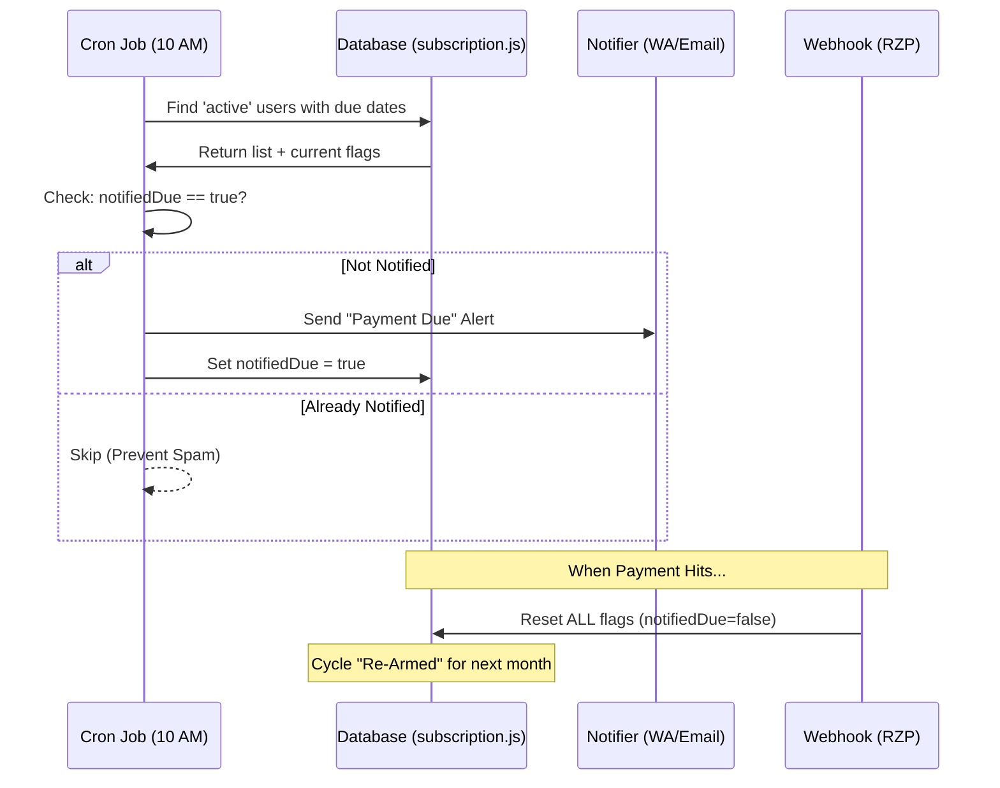

# RentBuddy Server: Master Architecture & Production Flow

This README provides the definitive technical and visual blueprint of the RentBuddy backend. It maps every line of code to the business logic required for a high-scale rental platform.

---

## 1. System Ecosystem (Master Flow)

### A. End-to-End Operational Lifecycle
*This Left-to-Right flow is optimized for wide screens and provides high-detail visibility into every layer.*

---

## 2. Advanced Path Logic: Cumulative vs Recurring

| Feature | Cumulative Flow (One-Time) | Recurring Flow (Subscription) |
| :--- | :--- | :--- |
| **Logic Root** | `routes/payments/razorpay.js` | `routes/payments/razorpayWebhook.js` |
| **Verification** | Client-side Signature + HMAC | Webhook Event Signature |
| **Fulfillment** | Instant (await-based) | Polling-based / Webhook-triggered |
| **Cycle Logic** | Fixed term (ends at period) | Auto-Renewing (monthly window) |

---

## 3. The "Smart Monitor": Continuous CRM Logic

Our system solves the "Spam Problem" common in automated billing.

---

## 4. Technical Specifications & Edge Cases

### A. The "Month-Aware" Billing Window
To handle the "Feb 28th" problem, we use the `setMonth(-1)` strategy:
- **Calculation**: `hasPaidThisCycle = lastPaymentAt >= nextChargeAt` (comparing dates only)
- **Leap Year Safe**: Handles February variations perfectly.
- **28th->2nd Edge Case**: Verified. A payment on Jan 28th correctly covers a due date of Feb 2nd.

### B. Global Resiliency
- **WhatsApp Dynamic Detection**: `whatsapp.service.js` automatically converts `+91999...`, `91999...`, or `999...` into the standardized format required by the Meta Graph API.
- **Fail-Safe SMTP**: The email engine is designed to handle isolated failures. If one network timeout occurs, the system logs it and continues processing the remaining user queue without crashing the process.

### C. Manual Admin Recovery
When an Admin marks a month as **Manual Skip**:
1.  Status moves to `active` instantly.
2.  `missedPayments` is reset to 0.
3.  **Critical**: All notification flags are cleared, effectively silence any pending "Strict" or "Grace" reminders for that month.

---
**RentBuddy Master Infrastructure** | *Designed for Precision, Built for Scale*
